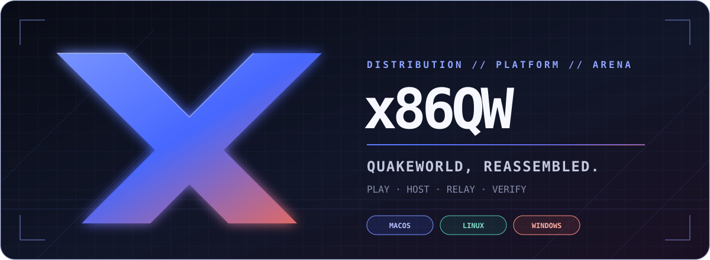
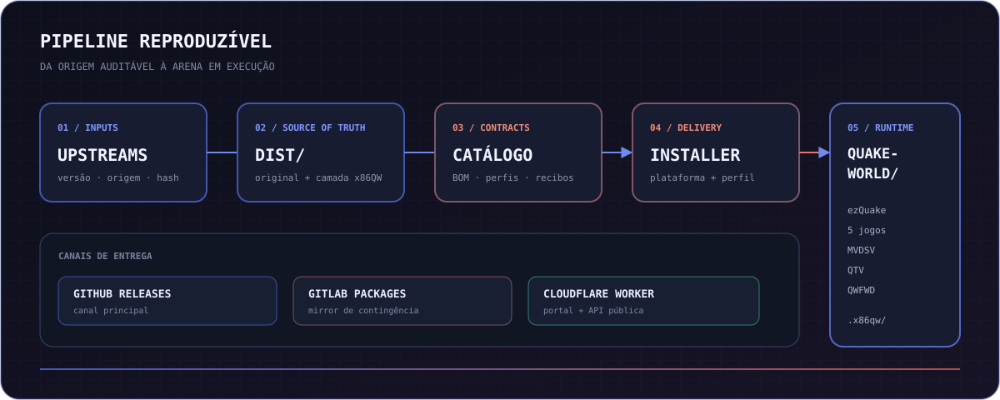

<div align="center">
  <picture>
    <source media="(prefers-color-scheme: dark)" srcset=".github/assets/hero-dark.svg">
    <source media="(prefers-color-scheme: light)" srcset=".github/assets/hero-light.svg">
    
  </picture>

  <br>

  **Uma distribuição moderna, reproduzível e autocontida de QuakeWorld.**<br>
  Cliente, jogos, servidor dedicado, relay e proxy — instalados por uma única CLI verificável.

  [](https://github.com/x86dx2/x86qw/releases/latest)
  [](https://github.com/x86dx2/x86qw/actions/workflows/validate.yml)
  [](https://x86qw.x86.com.br/)
  [](#compatibilidade)

  [**Instalar**](#instalação) · [Explorar](#o-que-vem-no-x86qw) · [Operar](#uma-cli-toda-a-arena) · [Arquitetura](#arquitetura) · [Contribuir](#contribuindo)
</div>

---

## QuakeWorld sem arqueologia

O x86QW transforma um ecossistema histórico em um produto atual: seleciona versões conhecidas, preserva as origens, aplica customizações isoladas e entrega tudo por um catálogo com tamanho e SHA-256. O resultado é uma instalação organizada, atualizável e capaz de jogar localmente, entrar em servidores ou subir sua própria infraestrutura.

<table>
  <tr>
    <td width="33%" valign="top"><h3>⚡ Entre na partida</h3>ezQuake stable ou nightly, conteúdo curado do nQuake e cinco jogos prontos para a mesma instalação.</td>
    <td width="33%" valign="top"><h3>🧩 Monte seu perfil</h3>Escolha entre os perfis essencial, recomendado, completo ou uma seleção personalizada de componentes.</td>
    <td width="33%" valign="top"><h3>🛡️ Verifique os bytes</h3>Pacotes imutáveis, hashes registrados, recibos locais e reparo explícito sem confundir arquivos pessoais com payload gerenciado.</td>
  </tr>
  <tr>
    <td width="33%" valign="top"><h3>🎯 Domine o KTX</h3>Duel, equipes, CTF, Race, Clan Arena, Wipeout, Frogbots e dezenas de combinações declarativas.</td>
    <td width="33%" valign="top"><h3>📡 Hospede a arena</h3>MVDSV, QTV e QWFWD independentes, em primeiro plano e restritos a loopback até você pedir exposição de rede.</td>
    <td width="33%" valign="top"><h3>♻️ Atualize com controle</h3>Veja o plano antes da mudança, confirme interativamente e use <code>--dry-run</code> em automações e auditorias.</td>
  </tr>
</table>

## Instalação

> [!IMPORTANT]
> O x86QW organiza e distribui software e conteúdo de diferentes origens. Leia [Proveniência e licenças](#proveniência-e-licenças) antes de redistribuir o conjunto.

### macOS e Linux

```sh
/bin/bash -c "$(curl -fsSL https://x86qw.x86.com.br/install.sh)"
```

### Windows PowerShell

```powershell
irm https://x86qw.x86.com.br/install.ps1 | iex
```

O bootstrap não encerra a sessão atual do PowerShell. Se o instalador Python
falhar, a mensagem e o código ficam visíveis na mesma janela por meio de
`$LASTEXITCODE`.

O Windows precisa de Python 3.10 ou mais recente. O bootstrap testa, nessa
ordem, `py -3`, `python3` e `python`; o atalho da Microsoft Store só é aceito
quando realmente executa uma versão compatível. Se nenhuma for encontrada:

```powershell
winget install --id Python.Python.3.13 -e
```

Depois da instalação, abra um novo PowerShell e execute novamente o comando do
x86QW.

O bootstrap público `0.6.0` valida o instalador por SHA-256, consulta o catálogo público e pergunta onde instalar. O sistema atual é detectado automaticamente. Para preparar outra plataforma a partir de macOS ou Linux:

```sh
/bin/bash -c "$(curl -fsSL https://x86qw.x86.com.br/install.sh)" -- --platform windows
```

Os valores aceitos são `macos`, `linux` e `windows`. Quer revisar tudo antes? Consulte o [manual do instalador](dist/installer/docs/installer.md) ou baixe diretamente pela [release mais recente](https://github.com/x86dx2/x86qw/releases/latest).

## O que vem no x86QW

### Cinco jogos, uma instalação

| Jogo | Versão | Experiência |
|---|:---:|---|
| **KTX** | 1.47 | Competitivo, equipes, CTF, Race e Frogbots |
| **Final Arena** | 1.20 | Arsenal e regras próprias em arenas QuakeWorld |
| **Pro-X** | 1.1 | Conversão completa preservada e harmonizada |
| **Team Fortress** | 2.9 | Classes, equipes e objetivos clássicos |
| **Total Destruction 2** | 2.22 | Gameplay expandido com customização x86QW isolada |

### Perfis para cada tipo de instalação

| Perfil | Conteúdo | Ideal para |
|---|---|---|
| **Essencial** | Base visual + KTX | Entrar rápido e jogar QuakeWorld competitivo |
| **Recomendado** | Essencial + mapas, skins, modelos, texturas e documentação | A experiência x86QW equilibrada |
| **Completo** | Todos os 21 componentes, cinco jogos, MVDSV, QTV e QWFWD | Jogadores, hosts e exploradores do ecossistema |
| **Personalizado** | Seleção explícita de componentes | Instalações mínimas ou especializadas |

<details>
<summary><strong>Modos KTX e opções avançadas</strong></summary>

O catálogo cobre 17 usermodes nativos: Duel, 2on2, 3on3, 4on4, 10on10, FFA, CTF, HoonyMode, Blitz 2v2/4v4, 2on2on2, 3on3on3, 4on4on4, XonX, Wipeout, Clan Arena e ThunderWalker ToT. Também inclui Midair, DMM4, Instagib, LGC, Rocket Arena, Race e Practice.

```sh
./x86qw.sh play ktx --mode duel --map dm6 --bots 1 --bot-skill 8 --bot-names x86qw
./x86qw.sh play ktx --mode ffa --map dm6 --bots 4 --bot-skill random
./x86qw.sh play ktx --mode ctf --ctf-hook smooth --ctf-runes off
./x86qw.sh play ktx --mode race --map slide1 --race-style match --race-scoring formula1
```

`--help` detalha Frogbots, regras de CTF e formatos de Race. O launcher valida mapas, combinações e limitações do QVM antes de iniciar o cliente.
No navegador interativo, essas opções aparecem somente quando fazem sentido:
os 24 modos são primeiro agrupados em recomendados, individuais, equipes,
arena/alternativos e treino, com uma entrada adicional para consultar o catálogo
completo. Nenhum modo é ocultado por essa organização.
Race pergunta formato, pontuação, pacemaker e visibilidade dos corredores; CTF
pergunta gancho, runas e spawn; modos compatíveis oferecem Frogbots, habilidade
e nomes. Há três perfis: `KTX Default`, nomes originais sem customização;
`x86QW aleatório`, a seleção inicial do menu com a lista One Piece embaralhada
a cada lançamento; e uma lista pessoal editável. Veja o
[guia de nomes dos Frogbots](docs/FROGBOTS.md).
Modos de tamanho fixo limitam a seleção às vagas restantes: Duel oferece no
máximo um bot quando há um jogador humano.
Ao entrar no mapa, o console imprime as teclas do modo ativo. Em Duel, `F5`
marca ready, `F6` interrompe e `F11` mostra as regras; com Frogbots, `INS`,
`DEL`, `HOME` e `END` gerenciam bots e habilidade. O perfil One Piece também
preserva as cores de camisa, calça e equipe definidas pelo KTX.
`--bot-skill random` sorteia uma habilidade independente de 1 a 20 sempre que
um bot entra. `F12` fecha diretamente o QuakeWorld em todos os cinco jogos.

</details>

## Uma CLI, toda a arena

Depois da instalação, `x86qw.sh` — ou `x86qw.cmd` no Windows — é o ponto único de entrada.
Sem argumentos, ele abre um navegador por tarefas: **Jogar**, **Encontrar
servidor**, **Hospedar**, **Serviços** e **Gerenciar instalação**.
Cada item mostra seu número equivalente. Use `↑`/`↓` ou `j`/`k`, avance com
`→`/Enter, volte exatamente uma etapa com `←`, use Esc para sair e pressione
`/` para buscar em listas longas. Atalhos com dois dígitos são confirmados com
Enter; listas maiores mostram a faixa visível e o total. Opções indisponíveis
continuam visíveis com o motivo. Em terminais estreitos, descrições e legendas
são quebradas sem perder contexto. Em terminais sem navegação interativa, o
mesmo fluxo usa opções numeradas.

Antes de abrir o ezQuake, **Jogar** apresenta jogo, modo, mapa, cliente, bots e o
comando equivalente. **Encontrar servidor** revisa servidor, ação e cliente;
QTV e QWFWD isolados também exibem endpoint, upstream e comando seguro antes da
confirmação. **Hospedar** escolhe jogo, regras e mapa antes da
infraestrutura; em seguida oferece **Rápido local** — loopback, MVD ativo e sem
serviços adicionais — ou **Avançado**, com rede, portas, QTV, QWFWD e senhas.
Esses fluxos exigem confirmação final e ainda não adquiriram lock nem iniciaram
processos quando o resumo é exibido. Toda ação concluída ou falha permanece
visível até Enter antes de o menu ser redesenhado. Segredos nunca aparecem no
comando equivalente. As flags abaixo continuam sendo o contrato estável para
automação e acesso direto.

Nos resumos, o comando equivalente usa `./x86qw.sh` em Unix e `x86qw.cmd` no
Windows. Hosts e serviços podem permanecer no terminal ou usar `--background`;
em segundo plano, o menu **Serviços** mostra controlador, processos, endpoints,
parâmetros e log, e oferece encerramento coordenado da stack.

```text
JOGAR                         OPERAR                         MANTER
x86qw play                    x86qw host                    x86qw update
x86qw play ktx --mode ctf     x86qw proxy                   x86qw upgrade
x86qw hub                     x86qw qtv                     x86qw verify
                              x86qw status
                                                             x86qw repair
```

| Comando | Faz o quê |
|---|---|
| `play` | Abre um dos jogos instalados no ezQuake |
| `host` | Inicia um servidor dedicado MVDSV |
| `proxy` | Executa o proxy de rota QWFWD |
| `qtv` | Inicia o relay/espectador QTV |
| `status` | Mostra a stack ativa; `--stop` solicita encerramento coordenado |
| `hub` | Abre o hub local da instalação |
| `update` | Atualiza a CLI e o que já está instalado |
| `upgrade` | Também incorpora novidades do perfil escolhido |
| `verify` | Compara a instalação com os recibos registrados |
| `repair` | Recompõe somente conteúdo gerenciado ausente ou incorreto |
| `cleanup` | Remove resíduos seguros identificados pela CLI |
| `uninstall` | Desinstala com confirmação explícita |
| `version` | Mostra a versão da CLI instalada |

### Hosting seguro por padrão

```sh
./x86qw.sh host ktx --mode 4on4 --map dm3
./x86qw.sh host team-fortress --map 2fort5r
./x86qw.sh host td2 --map dm6 --bind 0.0.0.0 --with-qtv
./x86qw.sh proxy --bind 0.0.0.0
./x86qw.sh qtv --upstream 127.0.0.1:28501
./x86qw.sh status
```

Serviços usam loopback por padrão e só são expostos com `--bind` explícito. Senhas podem vir de prompt oculto ou arquivo privado; a CLI evita colocá-las no comando filho e na saída. Locks e journals impedem manutenção concorrente, coordenam o encerramento e permitem recuperação conservadora após crash. Veja o [guia de hosting](docs/HOSTING.md).

## Arquitetura

<a href="docs/diagrams/x86qw-platform.html">
  <picture>
    <source media="(prefers-color-scheme: dark)" srcset=".github/assets/architecture-dark.svg">
    <source media="(prefers-color-scheme: light)" srcset=".github/assets/architecture-light.svg">
    
  </picture>
</a>

O repositório é a fonte canônica. `dist/` preserva os inputs; inventários declaram consumidores e dependências; o catálogo projeta pacotes públicos; o instalador materializa apenas o perfil e a plataforma escolhidos. GitHub Releases é o canal principal de artefatos e GitLab Generic Packages mantém o mirror de contingência.

```text
dist/           produto canônico, upstreams preservados e customizações x86QW
maintenance/    inventários, receitas, validação, build e publicação
site/           portal, API pública do catálogo e deploy Cloudflare
docs/           arquitetura, hosting, decisões e roadmaps
```

[Arquitetura detalhada](docs/architecture.md) · [Diagrama interativo](docs/diagrams/x86qw-platform.html) · [Proveniência](maintenance/docs/provenance.md) · [Roadmap](docs/ROADMAP.md)

## Compatibilidade

| Componente | macOS | Linux | Windows |
|---|:---:|:---:|:---:|
| ezQuake stable + nightly | Universal | x86-64 | x64 |
| MVDSV | Apple Silicon | amd64 | x64 |
| QTV | Apple Silicon | amd64 | x64 |
| QWFWD | Apple Silicon | amd64 | x64 |
| CLI e instalador | Python 3.10+ | Python 3.10+ | Python 3.10+ |

> [!NOTE]
> A matriz de CI valida catálogos, schemas, caminhos e a CLI em macOS, Linux e Windows com Python 3.10 e 3.13. Isso não equivale a um smoke gráfico nativo de cada runtime em cada plataforma; o [roadmap](docs/ROADMAP.md) mantém essa distinção explícita.

## Desenvolvendo

Quem clonou o repositório usa as fontes locais canônicas:

```sh
git lfs pull
./dist/installer/bin/manager.py verify
./dist/installer/bin/manager.py play
```

A validação integral não instala dependências Python adicionais:

```sh
./maintenance/manage.py verify
./dist/installer/bin/manager.py --help
./dist/installer/bin/manager.py play --help
cd site && npx --yes wrangler@4.114.0 deploy --dry-run
```

Para visualizar o portal localmente:

```sh
cd site
npx --yes wrangler@4.114.0 dev --ip 127.0.0.1 --port 8787
```

Abra `http://127.0.0.1:8787`. O fluxo completo de manutenção está em [maintenance/README.md](maintenance/README.md) e a operação do site em [site/README.md](site/README.md).

## Contribuindo

Contribuições são bem-vindas quando preservam proveniência, reprodutibilidade e a fronteira entre upstream e customização x86QW. Antes de abrir um PR:

1. leia o [guia de contribuição](.github/CONTRIBUTING.md);
2. mantenha cada mudança pequena e rastreável;
3. execute `./maintenance/manage.py verify`;
4. explique a origem e o consumidor de qualquer novo arquivo distribuído.

[Reportar um bug](https://github.com/x86dx2/x86qw/issues/new?template=bug-report.yml) · [Propor uma melhoria](https://github.com/x86dx2/x86qw/issues/new?template=feature-request.yml) · [Obter suporte](.github/SUPPORT.md) · [Política de segurança](.github/SECURITY.md)

## Proveniência e licenças

x86QW é uma distribuição composta, não uma relicença única de todos os seus componentes. Clientes, engines, mods, ferramentas e conteúdo mantêm suas licenças e termos de origem; customizações próprias ficam separadas dos bytes upstream. Os dados-base registrados são tratados como componente independente e não fazem parte do bundle enxuto do instalador.

Consulte [proveniência e licenças por componente](maintenance/docs/provenance.md) antes de copiar, publicar ou redistribuir artefatos. QuakeWorld, Quake e marcas relacionadas pertencem aos seus respectivos titulares; este projeto comunitário não é afiliado nem endossado por eles.

---

<div align="center">
  <strong>READY // CONNECT // FRAG</strong><br>
  <sub>Feito para preservar QuakeWorld — e continuar jogando.</sub><br><br>
  <a href="https://x86qw.x86.com.br/">Portal</a> ·
  <a href="https://github.com/x86dx2/x86qw/releases">Releases</a> ·
  <a href="https://gitlab.com/x86dx2/x86qw">Mirror GitLab</a> ·
  <a href="https://github.com/x86dx2/x86qw/issues">Issues</a>
</div>
